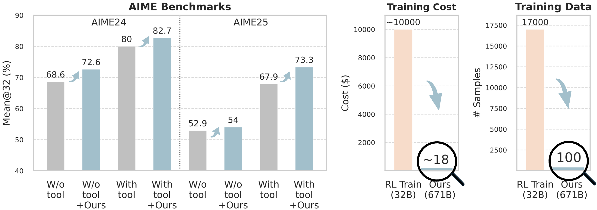

#  Training-Free GRPO Built on Youtu-Agent

[](https://arxiv.org/abs/2510.08191)

`Youtu-Agent` is a flexible, high-performance framework for building, running, and evaluating autonomous agents. Beyond topping the benchmarks, this framework delivers powerful agent capabilities, e.g. data analysis, file processing, and deep research, all with open-source models.

`Training-Free GRPO` is a cost-effective solution that further enhances `Youtu-Agent` performance without any LLM parameter updates. It consumes significantly fewer training data and lower costs on improving the 671B DeepSeek-V3.1-Terminus than fine-tuning a 32B model.



`Training-Free GRPO` leverages the group relative semantic advantage instead of numerical ones of rollouts in vanilla GRPO, iteratively distilling high-quality experiential knowledge during multi-epoch learning. Such knowledge serves as the learned token prior, which is seamlessly integrated during LLM API calls to guide model behavior. 


## 🚀 Getting Started

Follow the steps below to run the training and evaluation on math reasoning or web searching.

### 1. Setup

First, set up your Python environment and install the required dependencies in the project root.

```bash
# Clone the repository
git clone https://github.com/TencentCloudADP/youtu-agent -b training_free_GRPO

# Change to the project directory
cd youtu-agent

# Sync the environment with the lock file
uv sync  # or, `make sync`

# Activate the virtual environment
source ./.venv/bin/activate

# Upgrade datasets package to avoid potential issues
uv pip install --upgrade datasets
```

Next, configure your environment variables by copying the example file and filling in the necessary API keys in the project root.

```bash
cp .env.example .env
```

After copying, edit the `.env` file to add your credentials. For example, to use the DeepSeek API:

```ini
# LLM configuration (must be OpenAI API compatible)
# For more details, see: https://api-docs.deepseek.com/
UTU_LLM_TYPE=chat.completions
UTU_LLM_MODEL=deepseek-chat
UTU_LLM_BASE_URL=https://api.deepseek.com/v1
UTU_LLM_API_KEY=replace-with-your-api-key
```

Note: For web searching tasks, you may need to set up additional environment variables for web search APIs (e.g., Serper, Jina).
```ini
# Serper API key
SERPER_API_KEY=replace-with-your-serper-api-key
JINA_API_KEY=replace-with-your-jina-api-key
```

### 2. Run Training

To run training, go to the `training_free_GRPO` directory.
Use the `train.py` script. 

**Key Arguments**
- `--mode`: The mode of execution (`prompt` or `agent`, i.e., without tools or with tools)
- `--domain`: The domain of the tasks (`math` or `web`).
- `--experiment_name`: A unique name for your experiment run.
- `--dataset`: The name of the dataset to use for training.
- `--dataset_truncate`: Truncate the dataset to the first N samples.
- `--epochs`: The number of training epochs.
- `--batchsize`: The batch size for training.
- `--grpo_n`: The number of rollouts in a GRPO group.
- `--rollout_concurrency`: The concurrency level for rollouts.
- `--rollout_temperature`: The temperature for the LLM during rollouts.
- `--task_timeout`: The timeout for each task in seconds.

The following command runs a training session on a truncated `DAPO-Math-17k` dataset with only 100 problems.

```bash
python train.py \
    --mode agent \
    --domain math \
    --experiment_name DAPO100 \
    --dataset DAPO-Math-17k \
    --dataset_truncate 100 \
    --epochs 3 \
    --batchsize 100 \
    --grpo_n 5 \
    --rollout_concurrency 128 \
    --rollout_temperature 0.7 \
    --task_timeout 1800
```

For `web` domain, you can run the following command to train on the `AFM_web_RL` dataset (randomly sampled 100 examples by setting the `--dataset` to be `{dataset_name}_{sample_number}`).

```bash
python train.py \
    --mode agent \
    --domain web \
    --experiment_name AFM_web_RL_100 \
    --dataset AFM_web_RL_100 \
    --epochs 3 \
    --batchsize 4 \
    --grpo_n 5 \
    --rollout_concurrency 128 \
    --rollout_temperature 0.7 \
    --task_timeout 1800
```

### 3. Run Evaluation

To run an evaluation, use the `main.py` script in the `training_free_GRPO` directory. 

**Key Arguments**
- `--mode`: The mode of execution (`prompt` or `agent`, i.e., without tools or with tools)
- `--domain`: The domain of the experiment (`math` or `web`).
- `--experiment_name`: A unique name for your experiment run.
- `--experience_file`: The experience file saved in during training-free GRPO
- `--dataset`: The name of the dataset to use for evaluation.
- `--rollout_concurrency`: The concurrency level for rollouts.
- `--pass_k`: The pass@k metric to calculate.
- `--task_timeout`: The timeout for each task in seconds.

The following command runs an evaluation on the `AIME24` dataset for the `math` domain, using the experience file saved after 3-step learning.

```bash
python main.py \
    --mode agent \
    --domain math \
    --experiment_name AIME24_test_step_3 \
    --dataset AIME24 \
    --experience_file data/math/train/DAPO100/step_3/experiences.json \
    --rollout_concurrency 128 \
    --pass_k 32
```

For `web` domain, you can run the following command to evaluate on the `WebWalkerQA` dataset.

```bash
python main.py \
    --mode agent \
    --domain web \
    --experiment_name WebWalkerQA_test_step_3 \
    --dataset WebWalkerQA \
    --experience_file data/web/train/AFM_web_RL_100/step_3/experiences.json \
    --rollout_concurrency 128 \
    --pass_k 3
```

## 📚 Citation

If you find this work useful, please consider citing:

```bibtex
@misc{training_free_grpo,
      title={Training-Free Group Relative Policy Optimization}, 
      author={Tencent Youtu Lab},
      year={2025},
      eprint={2510.08191},
      archivePrefix={arXiv},
      primaryClass={cs.CL},
      url={https://arxiv.org/abs/2510.08191}, 
}

@misc{youtu-agent-2025,
  title={Youtu-agent: A Simple yet Powerful Agent Framework},
  author={Tencent Youtu Lab},
  year={2025},
  publisher = {GitHub},
  journal = {GitHub repository},
  howpublished = {\url{https://github.com/TencentCloudADP/youtu-agent}},
}
```

## ⭐ Star History


